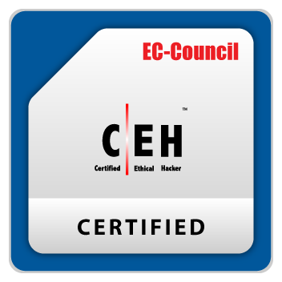

# # 👾 Aakash Singh

<div align="center">


<br>


</div>

---

## 🚀 About Me

```python
class AakashSingh:

    education = "B.Tech CSE @ Graphic Era University"

    focus = [
        "Backend Development",
        "Cybersecurity",
        "System Design",
        "Cloud Technologies"
    ]

    tech_stack = [
        "FastAPI",
        "React",
        "PostgreSQL",
        "Redis",
        "Node.js"
    ]

    certification = "Certified Ethical Hacker (CEH)"

    current_goal = "Building scalable and secure software"
```

* 🎓 B.Tech Computer Science Student
* 🔐 Certified Ethical Hacker (CEH)
* ⚡ Backend-focused Developer
* 🌐 Full-Stack Development Experience
* 🛡️ Security-First Engineering Mindset
* 🎮 Passionate about Game Development

---

## 🏅 Certification

<div align="center">



### Certified Ethical Hacker (CEH)

**EC-Council**

Credential ID: **ECC5190287643**

</div>

---

## ⚔️ Tech Arsenal

### Programming Languages

<p>

</p>

### Backend Development

<p>

</p>

### Frontend Development

<p>

</p>

### Databases

<p>

</p>

### Tools & Security

<p>

</p>

---

## 🏆 Featured Projects

### ⚡ ChargeX

**Smart EV Charging Station Management System**

* FastAPI + React 19
* PostgreSQL + Supabase
* Multi-role Authentication
* Real-time Station Management
* IEEE 830 SRS Documentation

---

### 🔨 BidMarket

**Real-Time Auction Platform**

* React.js
* Node.js
* PostgreSQL
* Redis
* Socket.io
* Stripe Integration

---

### 📍 AttendX

**Smart Attendance Management System**

* Flask Backend
* MongoDB
* KNN Proximity Algorithm
* Haversine Distance Validation
* Teacher Dashboard & Student Portal

---

### 🔍 SAST Tool

**Static Application Security Testing Tool**

* Custom Security Parser
* C/C++ Code Analysis
* Vulnerability Detection
* Secure Coding Analysis
* Severity Classification

---

### 🛡️ VulnScanner

**Web Vulnerability Scanner**

* SQL Injection Detection
* XSS Detection
* HTTP Header Analysis
* Directory Listing Detection
* Structured JSON Reporting

---

### 🛒 RBAC E-Commerce Security System

* Python + MySQL
* Admin / Seller / Customer Roles
* Secure Authentication
* Input Validation
* Privilege Separation

---

## 📊 GitHub Analytics

<div align="center">


</div>

---

## 🔥 Contribution Streak

<div align="center">


</div>

---

## 📈 Activity Graph

<div align="center">


</div>

---

## 🐍 Contribution Snake

<div align="center">


</div>

---

## 🌱 Currently Learning

* ☁️ Microsoft Azure
* 🏗️ System Design
* 🔒 Advanced Web Security
* ⚡ Distributed Systems
* 🎮 Game Development

---

## 📫 Connect With Me

<div align="center">

<a href="https://github.com/Flediko">

</a>

<a href="https://www.linkedin.com">

</a>

<a href="mailto:aakash2005singh@gmail.com">

</a>

</div>

---

<div align="center">

## 💡 Build. Break. Learn. Repeat.

*"Security is not a product, but a process."*

</div>
