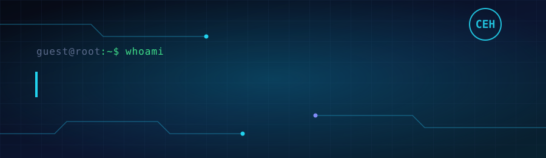

  

---

## 🧑‍💻 About Me

- 🎓 B.Tech CSE @ Graphic Era Deemed to be University (2023–2027)
- 💼 Python Developer Intern @ Zoom Into Web Pvt. Ltd.
- 🔐 Certified Ethical Hacker (CEH) — EC-Council, Cred. ID `ECC5190287643`
- 🌐 Portfolio: [aakashsingh.github.io](https://aakashsingh.github.io)
- 🎮 Long-term goal: game development

---

## 🛠️ Tech Stack

**Languages**

**Backend**

**Frontend**

**Data & Infra**

**Tools**

---

## 🚀 Featured Projects

| Project | What it does |
|---|---|
| **NotiSync** | Windows → Android notification sync; FastAPI + WebSocket backend, Capacitor app |
| **BidMarket** | Real-time auction platform — Redis caching, Socket.io live bidding |
| **Docx Overlay Reader** | Always-on-top translucent desktop overlay for reading/copying .docx & images across other windows — Tkinter + python-docx |
| **RefactorX** | Client-side C static analysis tool — five-phase pipeline, 40+ bug categories, zero deps |
| **AttendX** | GPS-based attendance system using KNN + Haversine distance |
| **VulnScanner** | Web vulnerability scanner — SQLi, XSS, misconfigurations |
| **RBAC E-Commerce** | Multi-role (Admin/Seller/Customer) e-commerce system with strict access control |
| **CusLang** | Custom interpreted language — lexer, parser, AST execution, lambdas, REPL |

---

## 🌱 Currently Learning

`Azure` · `System Design` · `Advanced Web Security` · `Distributed Systems` · `Game Dev`

---

## 📊 GitHub Stats

 

---

## 📫 Connect

*"Security is not a product, but a process."*

